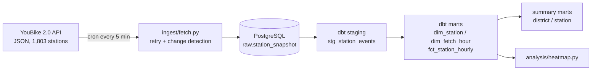

# Taipei YouBike Real-time Data Pipeline

[中文版](README.zh-TW.md)

An end-to-end data pipeline that ingests Taipei's YouBike 2.0 real-time station feed every 5 minutes, stores station **state-change events** in PostgreSQL, and models them with dbt into time-weighted hourly metrics — answering one question: **where and when do stations run out of bikes?**


*Share of observed time each district's stations spent with zero bikes, by hour (Taipei time, 06–23). Left: weekdays. Right: weekends.*

---

## Key findings

Observation window: 2026-09-18 → 2026-09-22 (~4 days, with gaps — see [Limitations](#limitations)). Metrics use 07:00–21:00, complete hours only.

| District | Weekday empty % | Weekend empty % |
|---|---|---|
| NTU Gongguan campus (臺大公館校區) | 15.9 | 12.3 |
| Da'an (大安區) | 9.3 | 5.8 |
| Zhongzheng (中正區) | 8.3 | 4.3 |
| Xinyi (信義區) | 6.8 | 3.8 |
| Songshan (松山區) | 6.6 | 2.9 |
| Neihu (內湖區) | 5.8 | 2.7 |
| Wenshan (文山區) | 5.2 | 4.0 |
| Beitou (北投區) | 3.8 | 2.9 |

1. **Every district is emptier on weekdays than on weekends.** The same-hour comparison in the heatmap shows this is a genuine commute effect, not an artefact of which hours were sampled.
2. **Office and commuter districts roughly double on weekdays** (Zhongzheng, Xinyi, Songshan, Neihu), with a clear morning band at 08–11 and a second wave at 17–22. Residential districts (Wenshan, Beitou) barely change.
3. **The NTU campus is the most bike-starved area in the city on both day types**, saturating the colour scale from late afternoon onward — a classic one-directional outflow point that rebalancing does not keep up with.

---

## Architecture



| Layer | Object | Grain |
|---|---|---|
| raw | `raw.station_snapshot` | one row per station state change, full JSON payload |
| staging | `stg_station_events` (view) | typed columns + `next_event_time` |
| mart | `dim_station` | one row per station (latest attributes) |
| mart | `dim_fetch_hour` | one row per hour, flags complete hours |
| mart | `fct_station_hourly` | station × hour, time-weighted metrics |
| mart | `fct_district_summary`, `fct_station_summary` | district / station × weekday-weekend |

Stack: Python · PostgreSQL 16 · dbt 1.9 · Docker Compose · cron · pandas / matplotlib

---

## Design decisions

### Store state changes, not full snapshots
The API returns the current state of all 1,803 stations. Storing every snapshot would mean ~520k rows/day, most of them identical to the previous one. Before inserting, the ingest script compares each station's available/return counts with its latest stored row and only writes stations that changed. Bike counts are step functions, so no information is lost — and daytime runs write roughly half the stations instead of all of them.

The primary key `(sno, info_time)` plus `ON CONFLICT DO NOTHING` keeps ingestion idempotent: re-running the same snapshot inserts nothing.

### Time-weighted metrics instead of event averages
The first version averaged bike counts over the events inside each hour. That silently under-counted the most important case: a station that empties at 18:50 and nobody touches for an hour has almost no events in the 19:00 bucket, so it barely appears in the data.

The staging model now carries `next_event_time` (via `LEAD()`), and the hourly fact computes how long each state lasted, clipped at hour boundaries. Metrics such as `avg_fill_rate` and `empty_minutes` are weighted by duration, so "empty for 55 minutes" counts as 55 minutes, not one event.

### Only use complete hours
Network outages on the host machine leave hours with few or no fetches. `dim_fetch_hour` flags an hour as complete when it has at least 11 of 12 expected runs, and all summary marts join on it. Missing hours are left blank in the heatmap rather than imputed.

### Store UTC, convert to Taipei time in the mart layer
Timestamps are stored as `timestamptz`. Conversion to `Asia/Taipei` happens once, in `fct_station_hourly`, because "rush hour" only means something in local time — bucketing by UTC would shift every peak by 8 hours.

### dbt runs in a container
The host has Python 3.14, which dbt's dependencies did not yet support. Rather than install a second system Python, dbt runs as a Compose service next to Postgres, reading credentials from environment variables so `profiles.yml` is safe to commit.

---

## Lessons learned

- **Read the data before trusting the docs.** I assumed `mday` was each station's last-update time and used it for de-duplication. After three runs every station had a new row: `mday` advances with the whole file. The key still guards against duplicate snapshots, but change detection had to be added separately.
- **Ratios need a denominator floor.** Ranking stations by "empty events / total events" put stations with a single event at 100% on top. Switching to time-weighted fill rate, plus capacity and observed-time thresholds, removed the small-sample artefacts.
- **Match the fix to the failure pattern.** DNS failures looked transient, so I added retry with backoff (10 / 30 / 60 s). The failure rate did not improve: of 26 failed runs afterwards, retries rescued almost none. Grouping the log by time showed failures came in blocks lasting tens of minutes — sustained network outages, not blips. Retry stays for genuine one-off errors; the outage gaps are handled downstream by the complete-hour filter.

---

## Limitations

- **Short observation window.** About four days, with outages on Friday night, Sunday afternoon and early Monday/Tuesday. Most heatmap cells represent one or two days; treat patterns as indicative, not conclusive.
- **Coverage bias within each hour.** `observed_minutes` is typically ~57, not 60, because the first event of an hour arrives a few minutes after the hour starts. The bias is consistent across stations, so comparisons hold.
- **`sarea` is not always a district.** Campus stations report `臺大公館校區` instead of an administrative district; they are kept as their own group.
- **Hour attribution uses insert time.** A run delayed by retries can land in the next hour, so an hour occasionally shows 13 runs.

---

## Reproduce

```bash
git clone <this-repo> && cd youbike-pipeline

# 1. credentials
cat > .env << 'EOF'
POSTGRES_USER=youbike
POSTGRES_PASSWORD=change-me
POSTGRES_DB=youbike
EOF

# 2. database + dbt
docker compose up -d
docker compose exec -T postgres psql -U youbike -d youbike < sql/01_raw.sql

# 3. ingestion
python3 -m venv .venv
.venv/bin/pip install requests "psycopg[binary]" python-dotenv pandas matplotlib
.venv/bin/python ingest/fetch.py

# 4. schedule (crontab -e)
# */5 * * * * cd /path/to/youbike-pipeline && .venv/bin/python ingest/fetch.py >> ingest.log 2>&1

# 5. transform + test
docker compose exec -w /usr/app/youbike dbt dbt run
docker compose exec -w /usr/app/youbike dbt dbt test

# 6. heatmap (needs a CJK font, e.g. fonts-noto-cjk)
.venv/bin/python analysis/heatmap.py
```

## Repository layout

```
youbike-pipeline/
├── docker-compose.yml
├── ingest/fetch.py            # fetch, retry, change detection, insert
├── sql/01_raw.sql             # raw schema
├── dbt/
│   ├── profiles/profiles.yml  # reads credentials from env vars
│   └── youbike/models/
│       ├── staging/
│       └── marts/             # dims, facts, summaries, schema tests
├── analysis/heatmap.py
└── docs/heatmap_district_hour.png
```

## Data source

[YouBike 2.0 臺北市公共自行車即時資訊](https://data.gov.tw/dataset/137993), Taipei City Department of Transportation, via the Government Open Data Platform.
