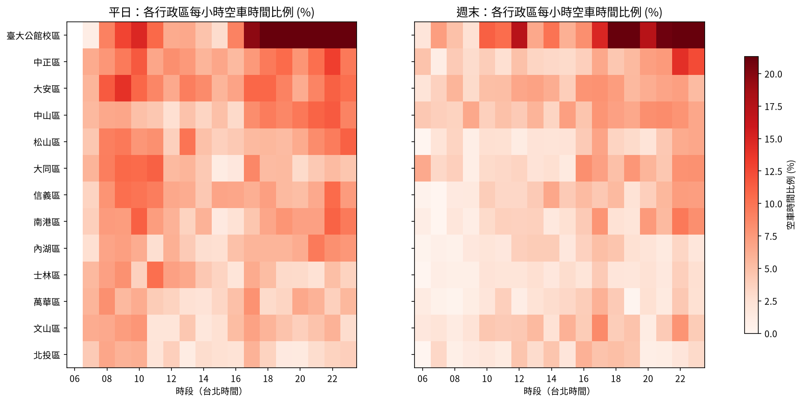
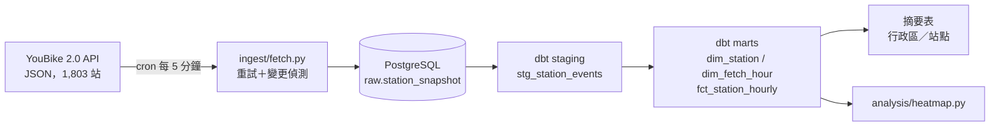

# 台北 YouBike 即時資料管線

[English](README.md)

每 5 分鐘抓取臺北市 YouBike 2.0 即時站點資料，只把「站點狀態變更事件」寫進 PostgreSQL，再用 dbt 建成時間加權的小時級指標，回答一個問題：**哪些站、在什麼時段會沒車可借？**



*各行政區站點每小時處於 0 輛車狀態的時間比例（台北時間 06–23 點）。左：平日；右：週末。*

---

## 主要發現

觀測期間：2026-09-18 至 2026-09-22（約 4 天，中間有斷點，見[限制](#限制)）。指標僅採 07:00–21:00 的完整小時。

| 行政區 | 平日空車 % | 週末空車 % |
|---|---|---|
| 臺大公館校區 | 15.9 | 12.3 |
| 大安區 | 9.3 | 5.8 |
| 中正區 | 8.3 | 4.3 |
| 信義區 | 6.8 | 3.8 |
| 松山區 | 6.6 | 2.9 |
| 內湖區 | 5.8 | 2.7 |
| 文山區 | 5.2 | 4.0 |
| 北投區 | 3.8 | 2.9 |

1. **13 個區全部都是平日比週末更缺車。** 熱力圖逐小時比較同一時段，可以排除「平日與週末採樣時段不同」的偏誤，這是真實的通勤效應。
2. **辦公／通勤區平日空車率約翻倍**（中正、信義、松山、內湖），早上 08–11 點一條明顯紅帶，17–22 點第二波；住宅區（文山、北投）平日週末差異很小。
3. **臺大公館校區平日與週末都是全市最缺車的區域**，傍晚之後直接頂到色階上限，是典型的單向淨流出點，調度補不上。

---

## 架構



| 層 | 物件 | 粒度 |
|---|---|---|
| raw | `raw.station_snapshot` | 每站每次狀態變更一列，保留完整 JSON |
| staging | `stg_station_events`（view） | 型別轉換＋`next_event_time` |
| mart | `dim_station` | 每站一列（最新屬性） |
| mart | `dim_fetch_hour` | 每小時一列，標記是否完整 |
| mart | `fct_station_hourly` | 站點 × 小時，時間加權指標 |
| mart | `fct_district_summary`、`fct_station_summary` | 行政區／站點 × 平日週末 |

技術：Python · PostgreSQL 16 · dbt 1.9 · Docker Compose · cron · pandas / matplotlib

---

## 設計決策

### 只存狀態變更，不存全量快照
API 每次回傳全部 1,803 站的當下狀態。每次都存，一天約 52 萬列，絕大多數與上一筆相同。寫入前先比對每站的可借／可還車數與資料庫中最新一筆，只寫有變動的站。車數是階梯函數，跳過不變的時段不會遺失資訊；白天每次大約只需寫入一半的站。

主鍵 `(sno, info_time)` 搭配 `ON CONFLICT DO NOTHING` 讓 ingest 具冪等性：同一份快照重跑不會多寫任何一列。

### 用時間加權，而非事件平均
第一版是把每小時內的事件直接平均。這會低估最關鍵的情況：一站在 18:50 被借空、之後一小時沒人動，它在 19 點那格幾乎沒有事件，等於在資料裡消失。

staging 層改用 `LEAD()` 帶出 `next_event_time`，事實表計算每個狀態持續多久（在整點處截斷），`avg_fill_rate`、`empty_minutes` 都以持續時間加權。「空了 55 分鐘」就算 55 分鐘，而不是一筆事件。

### 只採用完整小時
執行環境的網路中斷會造成某些小時抓取次數不足甚至為零。`dim_fetch_hour` 將 12 次中至少有 11 次的小時標為完整，所有摘要表都以它過濾。缺漏時段在熱力圖上留白，不做插補。

### 存 UTC，時區轉換放在 mart 層
時間以 `timestamptz` 儲存，只在 `fct_station_hourly` 轉成 `Asia/Taipei`。「尖峰時段」只有在當地時間下才有意義，用 UTC 分桶會讓所有尖峰偏移 8 小時。

### dbt 跑在容器裡
主機是 Python 3.14，dbt 的相依套件尚未支援。與其在系統裝第二套 Python，改把 dbt 做成 Compose 服務，憑證從環境變數讀取，`profiles.yml` 可以安全進版控。

---

## 踩過的坑

- **先看資料，再相信文件。** 原本以為 `mday` 是各站最後變動時間，拿來當去重鍵。跑三次後每站都多了一列：`mday` 其實跟著整份檔案一起更新。這個鍵仍能擋住重複快照，但變更偵測必須另外做。
- **比例指標要有分母門檻。** 用「空車事件數／總事件數」排序，結果前幾名都是整小時只有 1 筆事件、剛好為 0 的站。改用時間加權滿位率，再加上容量與觀測時間門檻，才排除小樣本假象。
- **修法要對應失敗型態。** DNS 失敗看起來是暫時性的，所以加了 10／30／60 秒退避重試。結果失敗率沒改善：改版後 26 次失敗幾乎都沒被救回。依時間檢視 log 才發現失敗是成段出現、每段持續數十分鐘，屬於持續性斷網而非瞬斷。重試保留處理真正的單次錯誤，斷網缺口交由下游的完整小時過濾處理。

---

## 限制

- **觀測期間短。** 約 4 天，週五深夜、週日下午、週一與週二清晨有斷點。熱力圖多數格子只代表 1–2 天，模式可作為參考，尚不足以下定論。
- **每小時的觀測涵蓋有系統性偏差。** `observed_minutes` 通常約 57 而非 60，因為每小時第一筆事件會晚幾分鐘出現。此偏差對所有站一致，不影響站間比較。
- **`sarea` 不一定是行政區。** 校園站點回報的是「臺大公館校區」，保留為獨立群組。
- **小時歸屬以寫入時間為準。** 因重試而延遲的抓取可能落到下一個小時，偶爾會出現某小時 13 次。

---

## 如何重現

```bash
git clone <this-repo> && cd youbike-pipeline

# 1. 憑證
cat > .env << 'EOF'
POSTGRES_USER=youbike
POSTGRES_PASSWORD=change-me
POSTGRES_DB=youbike
EOF

# 2. 資料庫與 dbt
docker compose up -d
docker compose exec -T postgres psql -U youbike -d youbike < sql/01_raw.sql

# 3. 抓取
python3 -m venv .venv
.venv/bin/pip install requests "psycopg[binary]" python-dotenv pandas matplotlib
.venv/bin/python ingest/fetch.py

# 4. 排程（crontab -e）
# */5 * * * * cd /path/to/youbike-pipeline && .venv/bin/python ingest/fetch.py >> ingest.log 2>&1

# 5. 轉換與測試
docker compose exec -w /usr/app/youbike dbt dbt run
docker compose exec -w /usr/app/youbike dbt dbt test

# 6. 熱力圖（需中文字型，如 fonts-noto-cjk）
.venv/bin/python analysis/heatmap.py
```

## 專案結構

```
youbike-pipeline/
├── docker-compose.yml
├── ingest/fetch.py            # 抓取、重試、變更偵測、寫入
├── sql/01_raw.sql             # raw schema
├── dbt/
│   ├── profiles/profiles.yml  # 憑證從環境變數讀取
│   └── youbike/models/
│       ├── staging/
│       └── marts/             # 維度、事實、摘要、schema 測試
├── analysis/heatmap.py
└── docs/heatmap_district_hour.png
```

## 資料來源

[YouBike 2.0 臺北市公共自行車即時資訊](https://data.gov.tw/dataset/137993)，臺北市政府交通局，政府資料開放平臺。
